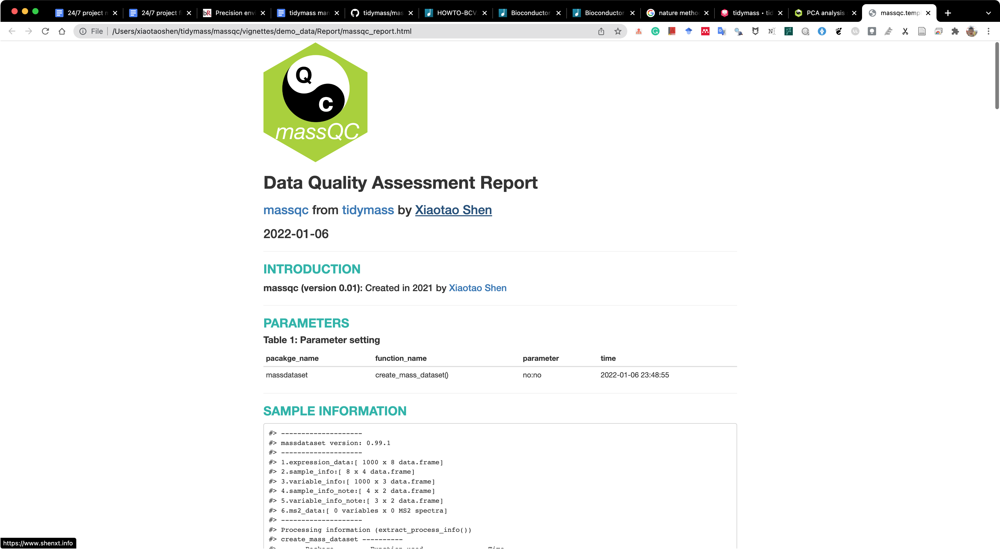

```{r, include = FALSE, echo=FALSE}
knitr::opts_chunk$set(
  collapse = TRUE,
  comment = "#>",
  warning = FALSE,
  message = TRUE,
  out.width = "100%"
)
```

# **Data preparation**

```{r,eval=TRUE,warning=FALSE, R.options="", message=FALSE, cache=TRUE}
library(massdataset)
library(tidyverse)
library(massqc)
data("sample_info", package = "massdataset")
data("expression_data", package = "massdataset")
data("variable_info", package = "massdataset")
object =
  create_mass_dataset(
    expression_data = expression_data,
    sample_info = sample_info,
    variable_info = variable_info
  )
object
```

# **massqc_report()**

```{r,eval=TRUE,warning=FALSE, R.options="", message=FALSE, cache=TRUE}
massqc_report(object, path = "demo_data")
```

Then one folder named as `Report` will be in the `demo_data` folder.


And open the `massqc_report.html`.



# **Session information**

```{r,eval=TRUE,warning=FALSE, R.options="", message=FALSE, cache=TRUE}
sessionInfo()
```
